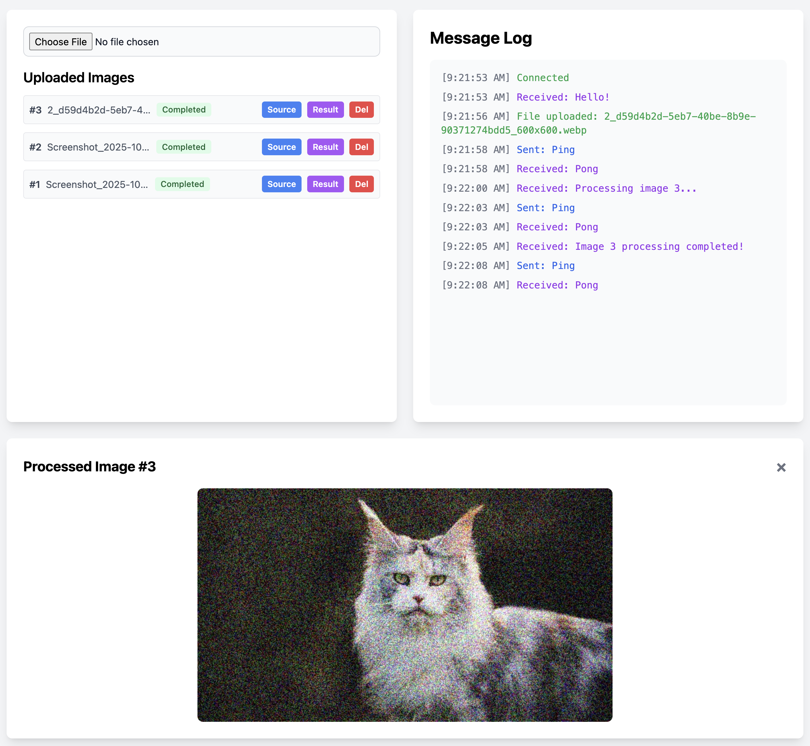

# Django Realtime Processing

Purpose is to demonstrate how to process images in the background and get realtime updates via websockets.

Prototype with Django 6.0 Alpha 1, Django Tasks and Django Channels.

# How to run

**NOTICE!** Since this is Django 6.0 and we're using the database backend in django-tasks, we need to modify the `CheckConstraint(check=..)` to `CheckConstraint(condition=...) in the following file: `django_tasks/backends/database/migrations/0005_alter_dbtaskresult_priority_and_more.py", line 19`

You also need to have `redis` running and accessible on port `6379`

Afterwards you can run via uv

```
$ uv sync
$ uv python manage.py migrate
$ uv python manage.py runserver
```

or via a virtual environment

```
$ python3 -m venv venv
$ source ./venv/bin/activate 
(venv) $ pip install -r requirements.txt
(venv) $ python manage.py migrate
(venv) $ python manage.py runserver
```

Then just navigate to `http://127.0.0.1:8000` in your browser

You also need to run task workers and since this branch is using `DatabaseBackend` from `django-tasks` you will need to run as many database workers as you want via:

```
$ python manage.py db_worker
```

The more workers you add, the more you can process at once.

# How to use

- Select an image to upload
- A record will be created instantly for that image
- Click on "Source" to see the image
- Click on "Process" to process the image
- Watch the logs in the right panel
- When the processing is done, the list item will be updated.
- Click on "Result" to view the processing result

The Ping/Pong interaction is there to demonstrate how the websocket is not blocked while the image upload/processing is happening.

# Screenshot



# Notice

This was _mostly_ generated by AI and is not intended for production use, it's just a proof of concept.

If you do not understand the technology or how it works, feel free to reach out
